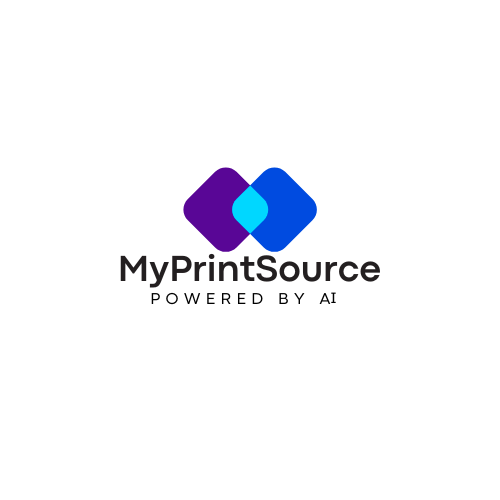

# MyPrintSource - AI-Powered Printing Platform



Transform how you create professional print materials with intelligent automation. Upload your designs and let AI instantly optimize files, suggest materials, and deliver quotes in seconds.

**Powered by Advanced AI** | Instant Quotes | Smart Optimization | Real-Time Tracking

---

## 🤖 What is MyPrintSource AI?

MyPrintSource is an intelligent printing platform that uses artificial intelligence to:

- ✨ **Automatically optimize** your print files for quality and production
- ⚡ **Generate instant quotes** based on AI analysis of your designs
- 🎯 **Recommend perfect materials** for your specific project needs
- 📊 **Track production** in real-time with automated quality checks
- 🚀 **Eliminate technical complexity** - no print expertise required

---

## 🚀 Quick Start

### 1. Clone & Install

```bash
git clone <repository-url>
cd myprintsource-site-*
npm install
```

### 2. Configure Environment

Create `.env.local` with your credentials:

```bash
# Supabase (Database)
NEXT_PUBLIC_SUPABASE_URL=https://your-project.supabase.co
NEXT_PUBLIC_SUPABASE_ANON_KEY=your-anon-key
SUPABASE_SERVICE_ROLE_KEY=your-service-role-key

# App Configuration
NEXT_PUBLIC_APP_URL=http://localhost:3000
```

### 3. Run Development Server

```bash
npm run dev
```

Visit `http://localhost:3000` to see your AI printing platform!

---

## ✨ Core Features

### AI-Powered File Processing
- **Automatic optimization** of resolution, color profiles, and bleeds
- **Intelligent error detection** and auto-fix for common print issues
- **Format conversion** - accepts any design file format
- **Quality assurance** - AI validates print-readiness before production

### Smart Quoting System
- **Instant pricing** based on AI analysis of complexity
- **Material recommendations** optimized for your design
- **Cost comparisons** across different options
- **Quantity optimization** suggestions for best value

### Real-Time Production Tracking
- **Live status updates** as your project moves through production
- **Automated quality checks** at every stage
- **Delivery notifications** with tracking information
- **Digital proof approvals** before printing begins

### Developer-Friendly API
- **Complete REST API** for custom integrations
- **Webhooks** for production status events
- **AI optimization endpoints** for programmatic access
- **OpenAPI documentation** at `/api/v1/docs`

---

## 📱 User Experience

### For Print Buyers
1. Upload your design files
2. Receive instant AI-optimized quote
3. Approve with one click
4. Track real-time production status
5. Receive professional prints

### For Businesses
1. Create branded portal at `myprintsource.com/your-company`
2. Share link with teams or clients
3. All projects automatically tracked in dashboard
4. AI handles technical complexity
5. Focus on design, not print specs

### For Developers
1. Get API credentials
2. Integrate AI printing into your app
3. Use webhooks for status updates
4. Access full documentation at `/api/v1/docs`

---

## 🎨 Technology Stack

**Frontend**
- Next.js 14 (App Router)
- React 18 with TypeScript
- Tailwind CSS + Custom AI Design System
- Responsive & Mobile-First

**Backend**
- Supabase (PostgreSQL + Auth)
- Server-side AI Processing
- Real-time WebSocket Updates
- Automated Quality Control

**AI Features**
- File Analysis & Optimization
- Material Recommendation Engine
- Intelligent Pricing Algorithms
- Quality Prediction Models

---

## 🔌 API Integration

### Authentication
```bash
X-API-Key: your-api-key
```

### Create Project (AI-Optimized)
```javascript
const response = await fetch('https://myprintsource.com/api/v1/bookings', {
  method: 'POST',
  headers: {
    'Content-Type': 'application/json',
    'X-API-Key': 'your-api-key'
  },
  body: JSON.stringify({
    user_id: 'account-id',
    guest_name: 'Client Name',
    guest_email: 'client@company.com',
    start_time: '2025-01-15T14:00:00Z',  // Delivery deadline
    end_time: '2025-01-15T16:00:00Z',
    notes: 'Business cards, 4/4 color, 14pt cardstock with UV coating'
  })
})

// AI will automatically:
// - Analyze file requirements
// - Optimize for print quality
// - Generate instant quote
// - Recommend best materials
```

### Get AI Recommendations
```javascript
const recommendations = await fetch('/api/v1/ai/recommendations', {
  method: 'POST',
  headers: { 'X-API-Key': 'your-key' },
  body: JSON.stringify({
    project_type: 'business_cards',
    quantity: 1000,
    budget_range: 'standard'
  })
})
```

---

## 🎨 Brand Colors

Based on the MyPrintSource AI logo:

```css
/* Primary - Technology & Trust */
--brand-primary: #0066FF;

/* Secondary - Creativity */
--brand-secondary: #6B1B9A;

/* Accent - Innovation */
--brand-accent: #00D9FF;

/* Utility */
--brand-dark: #2D2D2D;
--brand-light: #F0F4FF;
```

---

## 🚀 Deployment

### Deploy to Vercel

[](https://vercel.com/new)

1. Push code to GitHub
2. Import repository in Vercel
3. Add environment variables from `.env.local`
4. Set `NEXT_PUBLIC_APP_URL` to your domain
5. Deploy!

### Environment Variables for Production

```bash
NEXT_PUBLIC_SUPABASE_URL=<your-supabase-url>
NEXT_PUBLIC_SUPABASE_ANON_KEY=<your-anon-key>
SUPABASE_SERVICE_ROLE_KEY=<your-service-key>
NEXT_PUBLIC_APP_URL=https://myprintsource.com
NEXTAUTH_SECRET=<generate-with-openssl-rand>
```

---

## 📊 Database Schema

### Core Tables
- **users** - Account holders with AI preferences
- **bookings** - Print projects (AI-analyzed)
- **availabilities** - Production capacity schedules
- **event_types** - Print service categories
- **api_clients** - Developer integrations
- **ai_optimizations** - Automated file improvements

### AI-Enhanced Fields
- `ai_optimization_score` - Quality rating (0-100)
- `ai_material_recommendations` - JSON array of suggestions
- `ai_cost_predictions` - Estimated pricing tiers
- `ai_quality_flags` - Automated issue detection

---

## 🤝 Integration Ecosystem

MyPrintSource AI works seamlessly with:

- **Design Tools** - Adobe CC, Figma, Canva
- **E-commerce** - Shopify, WooCommerce
- **CRM Systems** - Salesforce, HubSpot
- **Project Management** - Asana, Monday.com
- **Custom Apps** - Full REST API access

---

## 📝 API Documentation

Full OpenAPI specification available at:
- **Production**: `https://myprintsource.com/api/v1/docs`
- **Development**: `http://localhost:3000/api/v1/docs`

### Key Endpoints

| Endpoint | Method | Description |
|----------|--------|-------------|
| `/api/v1/bookings` | POST | Create AI-optimized project |
| `/api/v1/bookings/{id}` | GET | Get project status |
| `/api/v1/ai/optimize` | POST | Optimize file for printing |
| `/api/v1/ai/quote` | POST | Get AI-generated quote |
| `/api/v1/users` | GET/POST | Manage accounts |

---

## 🔒 Security Features

- ✅ Supabase Row Level Security (RLS)
- ✅ API key authentication (SHA256)
- ✅ Rate limiting per client
- ✅ Input validation (Zod schemas)
- ✅ CORS protection
- ✅ Automated file scanning
- ✅ Encrypted data transmission

---

## 🧪 Testing

### Test AI Features
```bash
npm run dev
# Navigate to localhost:3000
# Upload a test file
# Observe AI optimization in action
```

### Test API Integration
```bash
npm run test:api
```

---

## 🆘 Support

**For Technical Issues**
- Email: api@myprintsource.com
- Documentation: `/api/v1/docs`
- GitHub Issues: (repository link)

**For Print Questions**
- Live Chat: Available in dashboard
- Email: support@myprintsource.com
- Phone: Available for enterprise clients

---

## 📜 License

MIT License - See LICENSE file for details

---

## 🌟 What Makes MyPrintSource Different?

**Traditional Print Services:**
- Manual file review (slow)
- Email back-and-forth for quotes
- Hidden technical requirements
- Delayed production updates
- Expert knowledge required

**MyPrintSource AI:**
- ✨ Instant AI optimization
- ⚡ Real-time quote generation
- 🎯 Automatic technical handling
- 📊 Live production tracking
- 🚀 Zero print expertise needed

---

## 🚀 Roadmap

### Current (v1.0)
- ✅ AI file optimization
- ✅ Instant quoting
- ✅ Material recommendations
- ✅ Real-time tracking
- ✅ Full API access

### Coming Soon (v1.1)
- 🔄 Batch processing AI
- 📸 AI color matching
- 🎨 Smart template suggestions
- 💬 AI chat support
- 🌍 Multi-language AI

### Future (v2.0)
- 🤖 Predictive inventory
- 🎯 Design improvement AI
- 📦 Smart packaging optimization
- 🌐 Global fulfillment network
- 🔮 Trend forecasting

---

**Built with 💙 by MyPrintSource AI**

*Transforming printing through artificial intelligence*
